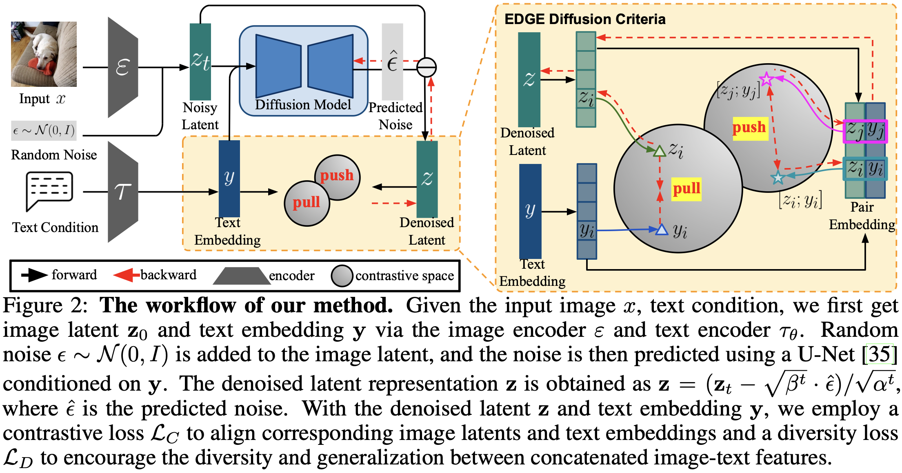

## Efficient Multimodal Dataset Distillation via Generative Models

🚧 **This repository is under construction** 🚧

This repository is an official PyTorch implementation of the NeurIPS 2025 paper: Efficient Multimodal Dataset Distillation via Generative Models

## **Abstract**
<div align="justify">
Dataset distillation aims to synthesize a small dataset from a large dataset, enabling the model trained on it to perform well on the original dataset. With the blooming of large language models and multimodal large language models, the importance of multimodal datasets, particularly image-text datasets, has grown significantly. However, existing multimodal dataset distillation methods are constrained by the Matching Training Trajectories algorithm, which significantly increases the computing resource requirement, and takes days to process the distillation. In this work, we introduce EDGE, a generative distillation method for efficient multimodal dataset distillation. Specifically, we identify two key challenges of distilling multimodal datasets with generative models: 
1) The lack of correlation between generated images and captions.
2) The lack of diversity among generated samples.
To address the aforementioned issues, we propose a novel generative model training workflow with a bi-directional contrastive loss and a diversity loss. Furthermore, we propose a caption synthesis strategy to further improve text-to-image retrieval performance by introducing more text information.  Our method is evaluated on Flickr30K, COCO, and CC3M datasets, demonstrating superior performance and efficiency compared to existing approaches. Notably, our method achieves results 18x faster than the state-of-the-art method.
</div>



## Installation

### Prerequisites

- Python 3.8+
- CUDA 11.0+ (for GPU support)

### Setup

```bash
# Clone the repository
git clone https://github.com/ichbill/EDGE.git
cd EDGE

# Create conda environment
conda create -n edge_vldd python=3.8
conda activate edge_vldd

# Install dependencies
pip install -r requirements.txt
```

## Project Structure

```
EDGE/
├── dataset/                    # Dataset loading modules
│   ├── coco_dataset.py
│   ├── flickr30k_dataset.py
│   ├── cc3m_dataset.py
│   └── randaugment.py
├── utils/                      # Utility modules
│   ├── networks.py            # Model architectures
│   ├── epoch.py               # Training/evaluation loops
│   └── vl_distill_utils.py    # Distillation utilities
├── evaluation/                 # Evaluation scripts
│   └── evaluation.py
├── edge_diffusion_train.py    # Main training script
├── edge_diffusion_sampling.py # Sampling script
├── sampling.py                 # Alternative sampling
├── caption_synthesis_gpt.py    # GPT-4 caption generation
├── caption_synthesis_llama.py  # Llama caption generation
├── caption_synthesis_llava.py  # LLaVA caption generation
└── convert_results_*.py        # Dataset format conversion
```

## Usage

### 1.  Pretrained Model Checkpoints Dataset Preparation

For pretrained model checkpoints and datasets, please follow the instructions at:
**https://github.com/silicx/LoRS_Distill/**

#### CC3M Dataset
Follow the [CC3M download instructions](https://github.com/google-research-datasets/conceptual-captions)

### 2. Training Diffusion Model

Train a Stable Diffusion model with EDGE diffusion losses:

```bash
python edge_diffusion_train.py
```

### 3. Generating Synthetic Data

Generate synthetic images using the trained model:

```bash
# Single GPU
python edge_diffusion_sampling.py \
    --dataset coco \
    --num_queries 1000 \
    --sd_model your_checkpoint \
    --save_tag experiment_name

# Multi-GPU
CUDA_VISIBLE_DEVICES=0,1,2,3 accelerate launch --num_processes=4 \
    edge_diffusion_sampling.py \
    --dataset coco \
    --num_queries 1000 \
    --sd_model your_checkpoint \
    --save_tag experiment_name
```

### 4. Caption Synthesis

Generate diverse captions using vision-language models:

#### Using GPT-4 Vision:
```bash
export OPENAI_API_KEY="your-api-key"
python caption_synthesis_gpt.py \
    --dataset coco \
    --label_file_path ./data/coco/annotations.json \
    --cpi 2 \
    --save_tag gpt4_captions
```

#### Using LLaVA:
```bash
CUDA_VISIBLE_DEVICES=0 python caption_synthesis_llava.py \
    --dataset coco \
    --label_file_path ./data/coco/annotations.json \
    --cpi 2 \
    --save_tag llava_captions
```

#### Using Llama:
```bash
python caption_synthesis_llama.py \
    --dataset coco \
    --image_root ./data/coco \
    --ann_root ./data/coco \
    --ckpt_dir /path/to/llama/checkpoint \
    --output_file ./synthesized_captions.json
```

### 5. Evaluation

Evaluate the distilled dataset:

```bash
CUDA_VISIBLE_DEVICES=0 python evaluation/evaluation.py \
    --dataset coco \
    --distill_image ./sampling_results/coco/experiment/images/ \
    --distill_ann ./sampling_results/coco/experiment/ \
    --image_root ./data/coco/ \
    --ann_root ./data/coco/ \
    --text_encoder bert \
    --batch_size_train 64 \
    --batch_size_test 100
```

## Roadmap

- [x] Code Release.
- [ ] Training Configuration Files.
- [ ] Pretrained Diffusion Checkpoints.
- [ ] Distilled Dataset Release.

For updates on these releases, please watch this repository or check back regularly.

## Citation

If you find this work useful, please cite:

```bibtex
@article{zhao2025efficient,
  title={Efficient multimodal dataset distillation via generative models},
  author={Zhao, Zhenghao and Wang, Haoxuan and Wu, Junyi and Shang, Yuzhang and Liu, Gaowen and Yan, Yan},
  journal={arXiv preprint arXiv:2509.15472},
  year={2025}
}
```

## Acknowledgments

Our code is built upon [LoRS](https://github.com/silicx/LoRS_Distill) and [Minimax Diffusion](https://github.com/vimar-gu/MinimaxDiffusion).